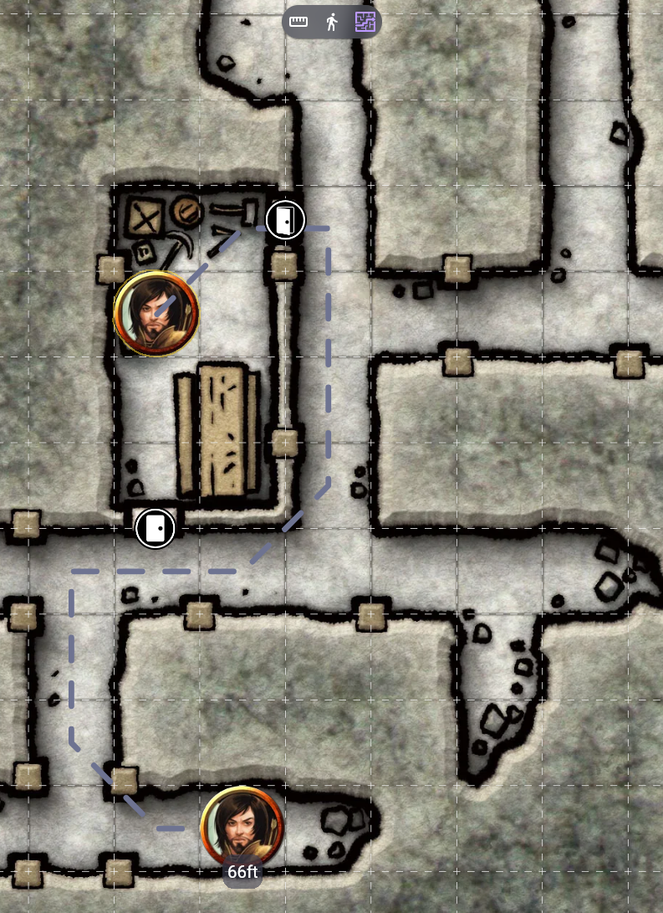
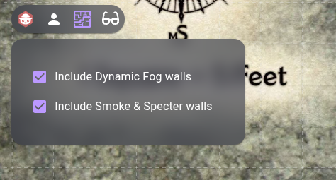

# Quickpath
Quickpath is an Owlbear Rodeo extension that adds a new object-aware ruler. It finds the shortest unobstructed path between the two selected points.

## How to use
This tool is extremely simple to use: simply select the "Measure" tool from the tools panel on the right hand side of the screen, and then press the "Find Path" mode (or the "P" keyboard shortcut). 

Then, click on a token and drag it to the desired location.

The distance traveled will be based on the measurement method and the scale of the current grid. 

## Settings
By default, Quickpath handles obstructions from both the Smoke & Specter and the official Dynamic Fog extensions. To toggle what should be taken into account, the DM can use the settings panel on the top left corner of the screen.

## Limitations
Currently, Quickpath can neither handle isometric maps nor the "Alternating" measuring method.
 